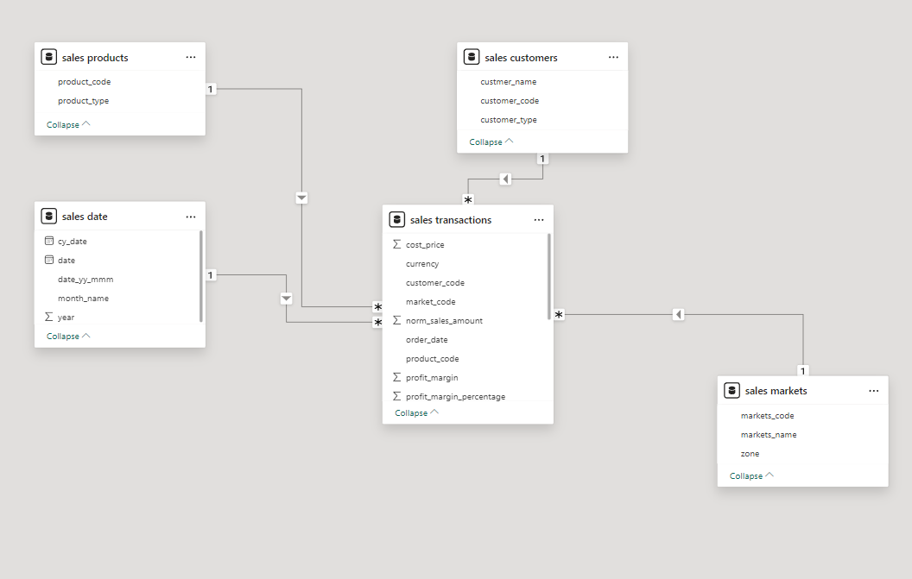

# Sales & Profitability Analysis – Hardware Distributor

**Tools:** MySQL · Power BI · Power Query · DAX  
**Data:** Transaction-level sales records · Oct 2017 – Jun 2020 · ₹985M total revenue  
**Repo:** [Data_Analytics/Sales_Insights_Dashboard](https://github.com/NagashreeHegde/Data_Analytics/tree/main/Sales_Insights_Dashboard)

---

## The Business Problem

This hardware distributor generated ₹985M in revenue over three years — yet the overall profit margin was only ~2.5%.

The business was tracking revenue and sales volume. What it was not tracking was where that revenue was generating profit and where it was silently destroying it.

This project analyses transaction-level data to answer one core question:                                                                                                                   
**why is a high-revenue business producing such weak margins — and what specifically is driving it?**

---

## Business Questions

- Why is overall profit margin only ~2.5% despite ₹985M in revenue?
- Which markets are generating real profit vs. thin or negative margins?
- Which customers contribute to profit and which erode it?
- How concentrated is profit across markets — and what risk does that create?
- How did revenue and margins trend in 2020, and what does the data show?

---

## Data Overview

| Detail | Value |
|--------|-------|
| Period | Oct 2017 – Jun 2020 |
| Granularity | Transaction-level |
| Source | MySQL database |
| Key dimensions | Markets · Customers · Products · Time |

**Data Model – Star Schema**



Tables:
- `sales_transactions` — fact table
- `sales_customers`
- `sales_products`
- `sales_markets`
- `sales_date`

---

## Key Metrics

| Metric | Full Period (2017–2020) | 2020 (Jan–Jun) |
|--------|------------------------|----------------|
| Total Revenue | ₹985M | ₹142M |
| Sales Quantity | ~2M units | ~350K units |
| Total Profit | ₹24.7M | ~₹2.1M |
| Overall Profit Margin | ~2.5% | ~1.5% |
| Top City by Revenue | Delhi | Delhi |
| Highest Profit Margin City | Surat | Bhubaneshwar |

---

## Dashboard

**Page 1 – Key Insights Overview**

.png.png)

Revenue trends, YoY comparison, market and city-level contribution. Separates high-revenue markets from genuinely profitable ones.

---

**Page 2 – Profitability & Margin Analysis**

.png)

Market-level margin %, revenue vs. profit breakdown, customer-level profit table. Identifies markets and customers operating at unsustainable margins.

---

**Page 3 – Customer & Market Performance**

.png)

Customer-level revenue, profit, margin %, and trend over time. Supports decisions on which customers to prioritise, renegotiate, or exit.

---

## Data Processing

**Power Query**
- Standardized schemas and business keys across all tables
- Resolved missing and unmatched customer/product keys that were causing blank revenue figures and distorted profit calculations
- Currency normalization across transaction records
- Consistency checks between fact and dimension tables

Fixing these data quality issues surfaced transactions that were previously not being counted in profitability calculations.

**DAX Measures**

All measures cross-validated against MySQL queries before use:

| Measure | Purpose |
|---------|---------|
| Total Revenue | Sum of transaction revenue |
| Total Profit | Revenue minus cost |
| Profit Margin % | Profit as % of revenue |
| Revenue Contribution % | Market or customer share of total revenue |
| YoY Revenue | Year-on-year revenue comparison |

---

## Key Findings

**Why is the margin only ~2.5%?**

Three factors explain it:

**1. Profit concentration**
48.5% of total profit comes from Delhi alone. The rest of the markets contribute very little to the bottom line, which makes the overall margin fragile and highly sensitive to any change in Delhi's performance.

**2. Structural loss in specific markets**
Bengaluru operates at a -21% average margin across the full three-year period. This is not a temporary dip — it reflects a pricing and cost structure that generates losses on every transaction in that market.

**3. Thin margins across most other markets**
Several markets operate below 3% margin. At that level, any pricing pressure, discount, or cost increase tips them into loss-making territory.

---

**Additional findings:**

- ElectricalSara Stores generates 38% of total profit at only 2.25% margin — profit driven primarily by volume, not pricing strength
- ElectricalLance Stores runs at -2% margin, which reduces overall reported profitability at current transaction costs
- Central Zone maintains the most stable margins across the full period

---

**2020 Revenue Trend**

Revenue declined sharply from Feb–Jun 2020. The cause is not determinable from transaction data alone and would require external context to investigate further. The margin impact is visible in the dashboard and is reflected in the 2020 metrics above.

---

## Recommendations

Based on the analysis:

- Review pricing and discount structure in Bengaluru — current unit economics are negative and cannot be fixed by volume growth alone
- Audit high-revenue, low-margin customers (below 3%) for renegotiation before extending contracts or credit
- Reduce profit concentration risk by developing mid-margin markets rather than doubling down on Delhi dependence
- Consider supplementing revenue reporting with margin % at the market level — current data suggests profitability visibility at the market level is limited

---

## Limitations

This analysis is based on the transaction and cost data available in the MySQL database. The following are not included:

- Customer acquisition and logistics costs by market
- Pricing contract terms per customer
- External competitive pricing data

Margin figures reflect recorded transaction costs only. A complete unit economics view would require finance and operations data beyond the scope of this dataset.

---

## Repository Structure

```
Sales_Insights_Dashboard/
│
├── README.md
├── MYSQL_Analysis.sql                            # KPI validation queries
├── Sales_Data.sql                                # Source data
├── Sales & Profitability Analysis(powerBi).pbix
└── Images/
    ├── Data_Modeling.png
    ├── Dashboard_Page1(Key Insights).png.png
    ├── Dashboard_Page2(ProfitcAnalysis).png
    ├── Dashboard_Page3(Performance Insights).png
    └── Dashboard_Page3.png
```

---

## Tools

| Tool | Use |
|------|-----|
| MySQL | Source data, KPI validation |
| Power Query | Data cleaning, schema standardization |
| Power BI Desktop | Dashboard development |
| DAX | Business measure calculations |

---

## About

**Nagashree Hegde** – Data Analyst · SQL · Python · Power BI

[LinkedIn](https://www.linkedin.com/in/nagashree-hegde) · [GitHub](https://github.com/NagashreeHegde)

---

*Every DAX measure in this report was validated against MySQL before inclusion. All findings are traceable to transaction-level source data.*
